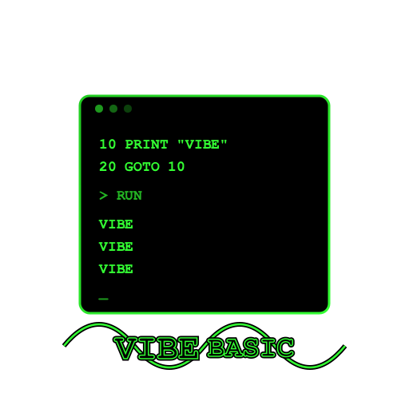

<p align="center">
  
</p>

# Vibe Basic Interpreter

A BASIC language interpreter written in Rust, implementing a subset of classic MS-BASIC (GW-BASIC style) with line-numbered programs, arithmetic expressions, string handling, and control flow.

The full language specification — EBNF grammar, semantic explanations, and example programs with expected output — is in [`vibe-basic-syntax.txt`](vibe-basic-syntax.txt).

Co-Authored-By: Claude Opus 4.6.  All code generated by Claude Code; no hand editing of the code was done (except in some of the BASIC examples).  See [`PRD.md`](PRD.md) for prompts.  No agents.md or claude.md file was used.

Pirate Island adapted from David Meny original at https://unbox.ifarchive.org/?url=/if-archive/games/source/basic/pirate.zip, Copyright 1985, Menco, Inc.

## Language Features

### Statements

| Statement | Syntax | Description |
|-----------|--------|-------------|
| LET | `[LET] var = expr` | Assign a value (`LET` keyword is optional) |
| PRINT | `PRINT [expr_list]` | Output values to the screen |
| INPUT | `INPUT ["prompt" (;\|,)] var` | Read user input (`;` appends `?`, `,` suppresses it) |
| IF/THEN/ELSE | `IF expr THEN clause [ELSE clause]` | Conditional (clause is a line number or statement) |
| GOTO | `GOTO linenum` | Unconditional jump |
| FOR/NEXT | `FOR var = start TO end [STEP val]` | Counted loop |
| GOSUB | `GOSUB expr` | Call subroutine (target may be a computed expression) |
| ON...GOSUB | `ON expr GOSUB n1, n2, ...` | Computed subroutine dispatch |
| RETURN | `RETURN [expr]` | Return from subroutine (optional target line number) |
| DEF FN | `DEF FNname[(params)] = expr` | Define a single-line user function |
| DATA | `DATA item, item, ...` | Inline data values |
| READ | `READ var [, var ...]` | Read the next DATA value into variables |
| RESTORE | `RESTORE [linenum]` | Reset the DATA pointer |
| DIM | `DIM var(n) [, var(m, p)]` | Dimension arrays (subscripts are 0-based) |
| ERASE | `ERASE var [, var ...]` | Remove arrays so they can be re-dimensioned |
| REM | `REM text` or `' text` | Comment (ignored by interpreter) |
| END | `END` | Terminate the program |

Multiple statements can appear on one line separated by colons (e.g., `10 X = 0 : Y = 10`).

### Expressions

Operator precedence from lowest to highest:

| Precedence | Operators |
|------------|-----------|
| Lowest | `OR` |
| | `XOR` |
| | `AND` |
| | `NOT` (unary) |
| | `=  <>  <  >  <=  >=` |
| | `+  -` |
| | `*  /` |
| | `^` (exponentiation) |
| Highest | `-` (unary negation) |

- All binary operators are left-associative.
- Comparisons return `-1` (true) or `0` (false), MS-BASIC style.
- `AND`, `OR`, `XOR`, `NOT` operate as bitwise integer operations.
- `+` performs string concatenation when both operands are strings.
- String comparison is supported with all comparison operators.

See the [full specification](vibe-basic-syntax.txt) for the complete EBNF grammar.

### Built-in Functions

| Category | Functions |
|----------|-----------|
| Numeric | `INT` `ABS` `SQR` `RND` `EXP` `LOG` `SGN` `SIN` `COS` `TAN` `ATN` `FIX` `CINT` `CSNG` `CDBL` |
| String/Substring | `LEN` `LEFT$` `RIGHT$` `MID$` `INSTR` |
| Conversion | `ASC` `CHR$` `STR$` `VAL` `HEX$` `OCT$` |
| Formatting | `STRING$` `SPACE$` `SPC` `TAB` |
| Binary Data | `MKI$` `MKS$` `MKD$` `CVI` `CVS` `CVD` |

See the [full specification](vibe-basic-syntax.txt) for detailed parameter descriptions and behavior.

### Variables

Variable names start with a letter and may contain letters, digits, and underscores. Names are case-insensitive (stored uppercase). An optional type sigil indicates the type:

- `$` — string, `%` — integer, `!` — single-precision, `#` — double-precision

### Arrays

Arrays are declared with `DIM` and support multiple dimensions with 0-based subscripts. Using an array without `DIM` auto-dimensions it with a maximum subscript of 10. See the [full specification](vibe-basic-syntax.txt) for details.

### PRINT Formatting

- **Semicolon** (`;`) — suppresses spacing; next output continues on the same line
- **Comma** (`,`) — advances to the next 14-character tab zone
- **No separator at end** — prints a newline after the last item

## Project Structure

```
src/
├── main.rs          — CLI entry point: reads .bas files, supports --debug flag
├── token.rs         — Lexer/tokenizer: converts source text into tokens
├── expr.rs          — Expression parser: builds expression parse trees
├── eval.rs          — Evaluator: stack-based iterative expression evaluator
├── ast.rs           — Statement/program parser: parses tokens into an AST
├── interpreter.rs   — Interpreter: executes BASIC programs with full control flow
└── debugger.rs      — Debugger: interactive step-through debugging REPL
scripts/
├── setup-cross-compile.sh — Install cross-compilation toolchains and configure Cargo
└── build.sh                — Build release binaries for native and/or cross-compile targets
```

## Building

Requires Rust (edition 2021). Build with:

```sh
cargo build
```

For a release build:

```sh
cargo build --release
```

Or use the build script, which builds a release binary for the native platform:

```sh
scripts/build.sh
```

## Cross-compilation

Two scripts in the `scripts/` directory automate cross-compilation setup and building. They detect the host OS and install the appropriate toolchains.

### Supported targets by host OS

Mac supports building all current targets, so it is the preferred development environment.

| Host OS | Native Target | Cross-compile Targets |
|---------|--------------|----------------------|
| macOS | `aarch64-apple-darwin` or `x86_64-apple-darwin` | `x86_64-unknown-linux-gnu`, `x86_64-unknown-linux-musl`, `x86_64-pc-windows-gnu`, `aarch64-pc-windows-gnullvm` |
| Linux | `x86_64-unknown-linux-gnu` | `x86_64-pc-windows-gnu`, `aarch64-pc-windows-gnullvm` |
| Windows | `x86_64-pc-windows-msvc` or `aarch64-pc-windows-msvc` | *(native only)* |

### One-step build for all targets

Run `build.sh` to build a release binary for the native target:

```sh
scripts/build.sh
```

To also build all cross-compilation targets (installs required toolchains if not already present):

```sh
scripts/build.sh --all
```

Binaries are placed in `target/<target>/release/`.

### Setup only

To install cross-compilation dependencies without building, run the setup script on its own. It is idempotent and safe to run multiple times:

```sh
scripts/setup-cross-compile.sh
```

## Running

Pass a `.bas` file as an argument:

```sh
cargo run -- examples/hello.bas
```

Or use the compiled binary directly:

```sh
./target/release/vibe-basic myprogram.bas
```

### Debug Mode

Launch the interactive debugger with the `--debug` flag:

```sh
cargo run -- --debug examples/primes.bas
```

The debugger provides a REPL with the following commands:

| Command | Description |
|---------|-------------|
| `STEP` | Execute one BASIC line |
| `RUN` | Continue execution until a breakpoint or END |
| `LIST` | Print the entire program listing |
| `LIST n` | Print the program starting from line number n |
| `LIST n m` | Print program lines from n through m (inclusive) |
| `GOTO n` | Jump to line number n |
| `BREAK AT n` | Set a breakpoint at line number n |
| `BREAK IF expr` | Set a conditional breakpoint |
| `LET var = expr` | Modify a variable during execution |
| `PRINT expr` | Evaluate and print an expression |
| `var = expr` | Shorthand for `LET var = expr` (implicit LET) |
| `HELP` | Show a list of debugger commands |
| `QUIT` | Exit the debugger |

The prompt shows the current line number (e.g., `[DBG line 20]>`) or `[DBG finished]>` when the program has ended.

### Example Programs

Several example programs are included in the `examples/` directory:

| File | Description |
|------|-------------|
| `hello.bas` | Powers of 2 using a FOR loop |
| `count.bas` | Counting to N with user input |
| `fibonacci.bas` | Fibonacci series with input validation |
| `guessing_game.bas` | Number guessing game using RND and nested ELSE |
| `primes.bas` | Prime number finder with nested FOR loops |
| `adventure.bas` | Text adventure game |
| `pirate.bas` | Pirate Island adventure game |
| `alice.bas` | Alice in Wonderland game |
| `gosub.bas` | GOSUB/RETURN demonstration |
| `arrays.bas` | Array operations with DIM |
| `data.bas` | DATA/READ/RESTORE demonstration |
| `math.bas` | Math functions demonstration |
| `powers.bas` | Powers calculation |
| `strings.bas` | String function demonstration |

### Example Program

Create a file `counter.bas`:

```basic
10 REM COUNTER PROGRAM
20 LET X = 1
30 PRINT "NUMBER:"; X
40 X = X + 1
50 IF X <= 3 THEN GOTO 30
60 PRINT "PROGRAM COMPLETE."
70 END
```

Run it:

```
$ cargo run -- counter.bas
NUMBER: 1
NUMBER: 2
NUMBER: 3
PROGRAM COMPLETE.
```

## Testing

Run the full test suite (663 tests):

```sh
cargo test
```

Tests are organized by module:

| Module | Tests | Coverage |
|--------|-------|----------|
| `token` | 43 | Lexer: numbers, strings, operators, keywords, sigils, remarks |
| `expr` | 45 | Expression parser: precedence, associativity, parentheses, functions |
| `eval` | 268 | Evaluator: arithmetic, comparisons, strings, all built-in functions, edge cases |
| `ast` | 90 | Statement parser: all statement types, IF/THEN/ELSE, multi-statement lines |
| `interpreter` | 175 | Integration: control flow, loops, I/O, arrays, DATA/READ, user functions |
| `debugger` | 42 | Debugger: stepping, breakpoints, LIST, variable inspection and modification |

## Formatting

The project uses `rustfmt` with a 120-character line width (configured in `rustfmt.toml`):

```sh
cargo fmt
```
